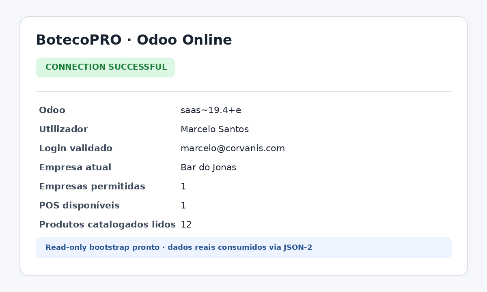
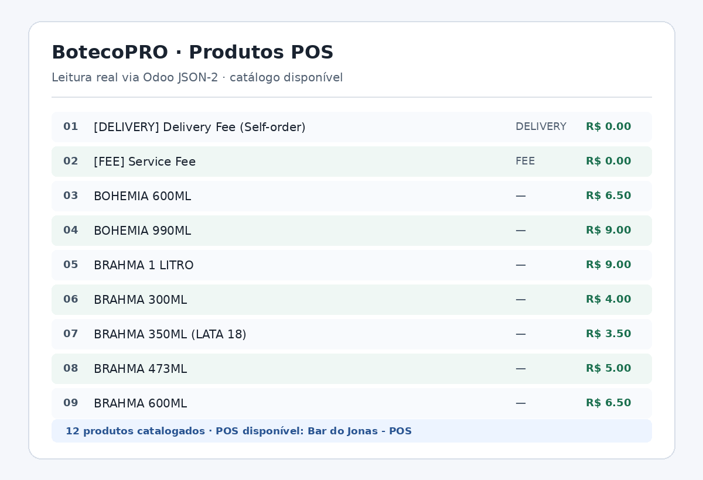

# Evidências reais da integração Odoo Online

Estas duas capturas são os arquivos originais, sem edição, redimensionamento ou
redação de pixels. Foram recuperadas byte por byte do commit `916f5e5` a pedido
explícito do proprietário do repositório para manter os dados reais visíveis.

## Autenticação e bootstrap read-only

SHA-256:
`1126b253c8d9f87cbbeb9445b84561042dea0832a98e88fc6cf5f398672b894a`

## Leitura real do catálogo POS

SHA-256:
`c4c2366f770211603b13a2a1da87ea1f7218a8fa50ebd74dc8f7313fff1f5d5a`

## Escopo e segurança

As imagens exibem deliberadamente nome, login, empresa, POS, nomes de produtos
e preços reais. O repositório é público. Uma nova inspeção visual e dos arquivos
não encontrou API key, token, header `Authorization`, cookie, password, CNPJ,
CPF ou parâmetro secreto em URL.

Elas registram o resultado do diagnóstico e da leitura JSON-2; não são uma
captura pixel a pixel das telas Flutter atuais. A comprovação executável é a
combinação da CI sem segredos com o smoke autenticado read-only descrito em
`docs/development/README.md`.

Nenhuma operação de `pos.order`, pagamento, stock ou contabilidade foi usada
para produzir estas evidências. Novas imagens continuam ignoradas por padrão e
exigem revisão explícita antes de entrar no Git.
