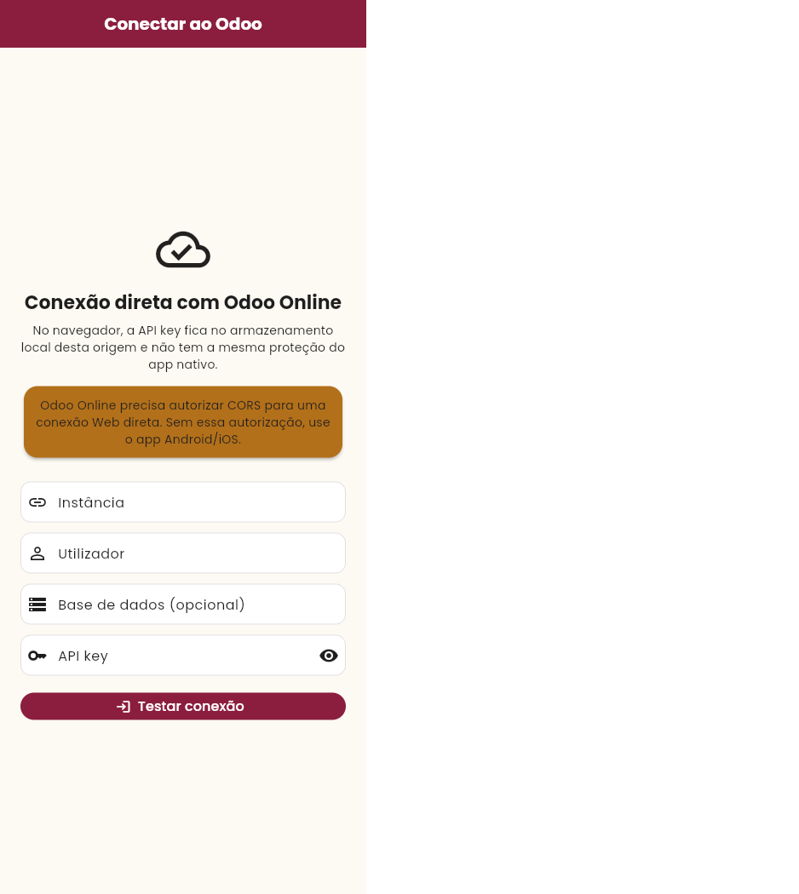
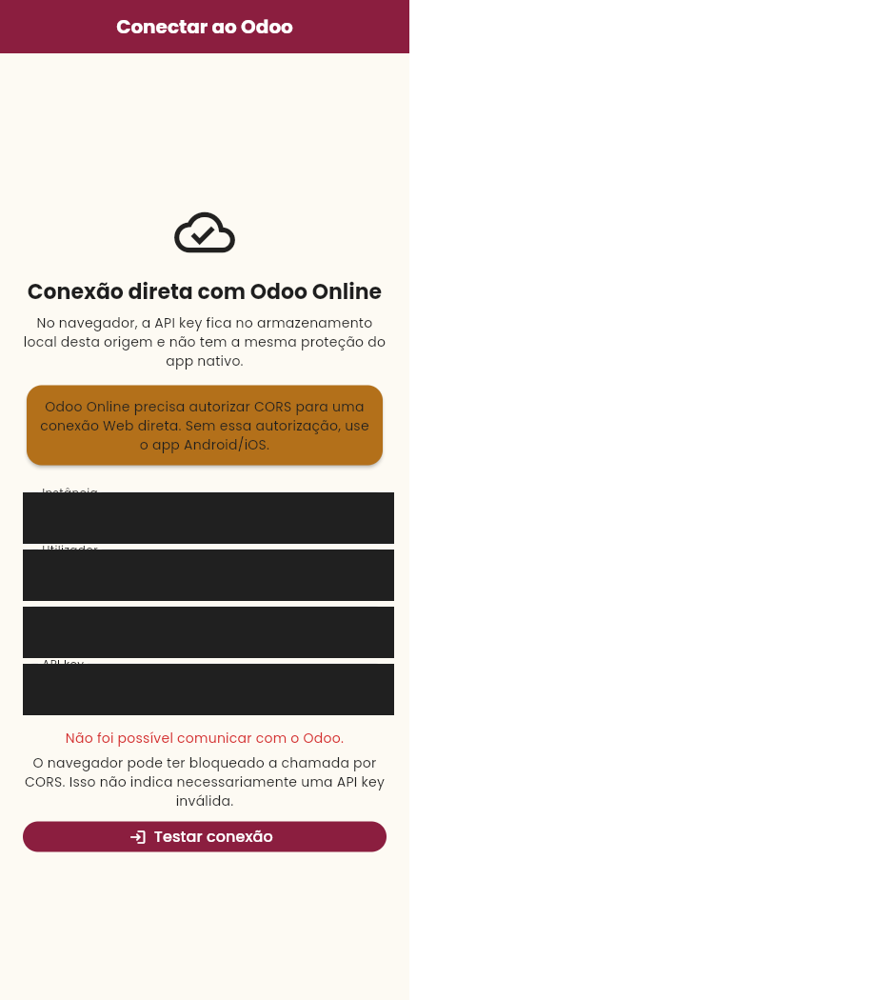
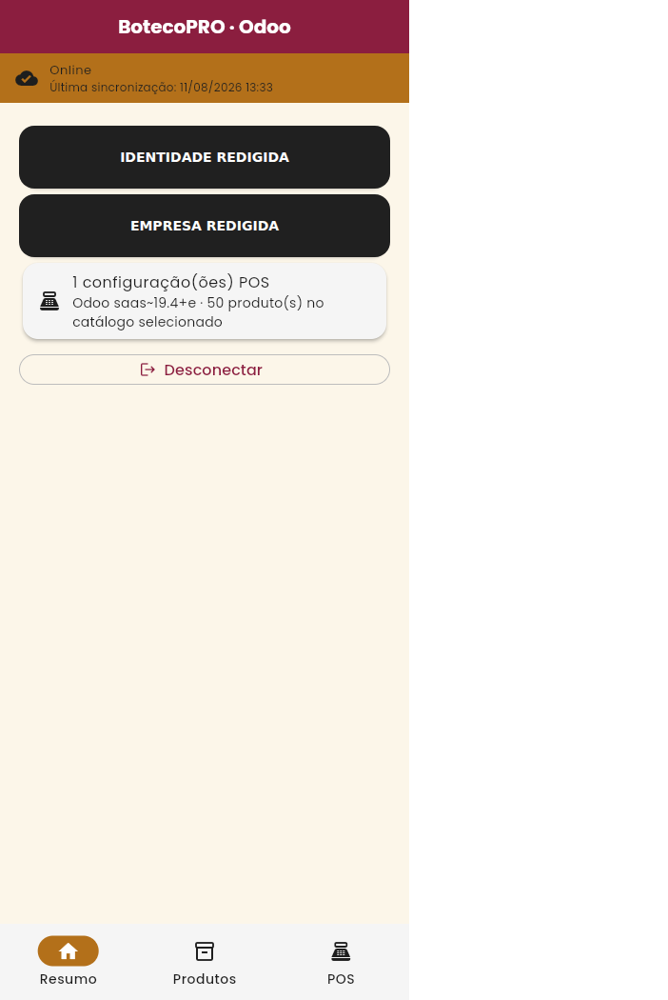

# Evidências reais da integração Odoo Online

Estas duas capturas são os arquivos originais, sem edição, redimensionamento ou
redação de pixels. Foram recuperadas byte por byte do commit `916f5e5` a pedido
explícito do proprietário do repositório para manter os dados reais visíveis.

## Autenticação e bootstrap read-only

SHA-256:
`1126b253c8d9f87cbbeb9445b84561042dea0832a98e88fc6cf5f398672b894a`

## Leitura real do catálogo POS

SHA-256:
`c4c2366f770211603b13a2a1da87ea1f7218a8fa50ebd74dc8f7313fff1f5d5a`

## Escopo e segurança

As imagens exibem deliberadamente nome, login, empresa, POS, nomes de produtos
e preços reais. O repositório é público. Uma nova inspeção visual e dos arquivos
não encontrou API key, token, header `Authorization`, cookie, password, CNPJ,
CPF ou parâmetro secreto em URL.

Elas registram o resultado do diagnóstico e da leitura JSON-2; não são uma
captura pixel a pixel das telas Flutter atuais. A comprovação executável é a
combinação da CI sem segredos com o smoke autenticado read-only descrito em
`docs/development/README.md`.

Nenhuma operação de `pos.order`, pagamento, stock ou contabilidade foi usada
para produzir estas evidências. Novas imagens continuam ignoradas por padrão e
exigem revisão explícita antes de entrar no Git.

Capturas reproduzíveis novas usam `make android-evidence` e são geradas em
`.artifacts/evidence/<RUN_ID>/`, nunca diretamente neste diretório. O pipeline
executa a jornada Flutter sintética completa em Android, registra nove capturas
somente após as respectivas asserções, classifica a fonte, gera
manifesto/hashes/relatórios e audita artefatos textuais.
Evidência `REAL_INSTANCE` continua exigindo inspeção visual manual; captura não
autoriza publicação.

## Flutter Web em Chrome

As capturas abaixo foram produzidas do build Web release em Chromium, com
viewport móvel e locale `pt-BR`. Os campos de conexão foram mascarados na
captura e a identidade/empresa foram redigidas antes da gravação do arquivo.

SHA-256:

- `connection.png`: `e2b097055ea89de10c5a9313b8959380189a23e26e517db92947a52923670a92`
- `cors-diagnostic.png`: `825daaa02faf3456b41e1324d727f61bee9c5e5f2ae01414db9d1db15496fc5d`
- `authenticated-sanitized.png`: `f28932012a7521094a23923330b97f1c721bc570d6e5fdc2c0624d61b8cbc7de`

A terceira captura comprova que o gate do aplicativo prossegue após uma
autenticação válida e que o bootstrap read-only chega à empresa, POS e ao
catálogo. Para isolar o comportamento do aplicativo, esse ensaio local usou um
processo Chrome temporário com a política CORS desativada. Isso **não** torna o
build adequado para implantação Web: em Chrome normal, a própria instância
Odoo bloqueia a requisição, como registra a segunda captura. A evidência Web
não contém a API key e não substitui o smoke nativo read-only.
